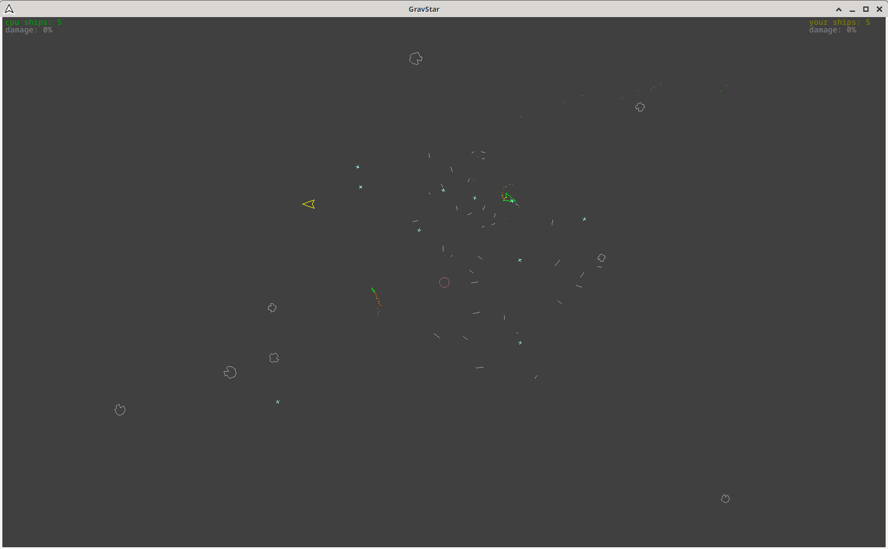

GravStar v1.04 Oct 2020

Retro styled space shooter arcade game, featuring missiles, asteroids, with inertia and gravity effects.

Requires FLTK library, e.g: fltk-1.3.4-2

Compiles with GNU GCC on Ubuntu 18.04, 20.04

Code used to also compile and run on Windows via msys/mingw, but this has not been tested for some time, so may no longer compile or may perform badly.

How to Build

 
Create a folder (choose a folder path without white spaces else the 'open_editor.sh' script below won't work), give it read/write/execution permissions

Put all files in this folder and type:

make

(no need to install)

How to Run

 
./gravstar

It will create one config file in same folder: 'gravstar.ini'

See 'help.txt' on how to play.

Edit 'open_editor.sh' and specify your favourite text edit, this will allow the opening of 'help.txt' while program is running.
e.g: gedit $1&

You can force where the config file should be read/stored and what its name should be, like this: 
./gravstar --cf ~/.gravstar.ini

Some of the code is repurposed from other projects I've tinkered with over the years, so excuse the antiquated c style, evolving conventions and inefficiencies. I've added features to it over some years, so coding ideas may not be implemented uniformly and appear ad-hoc. It started as a few Newtonian physics demos, but now it's a game - Enjoy.

